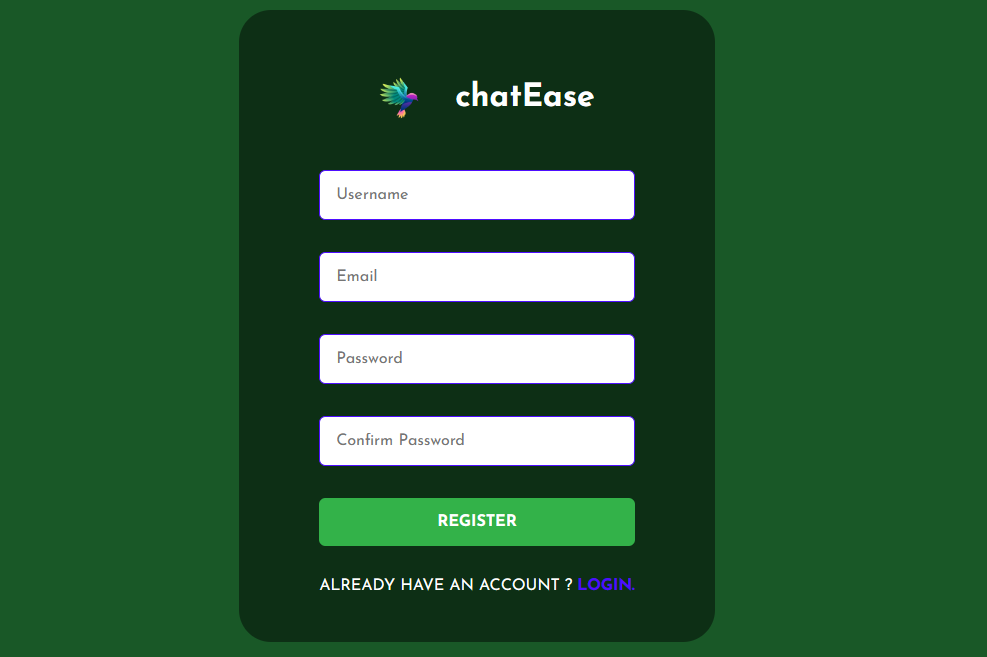
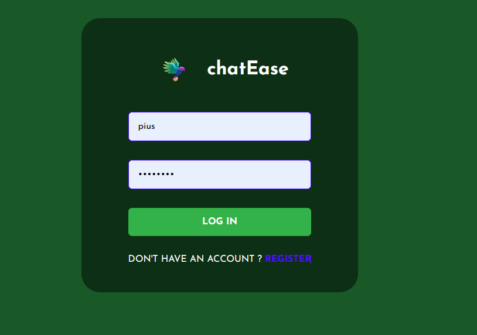
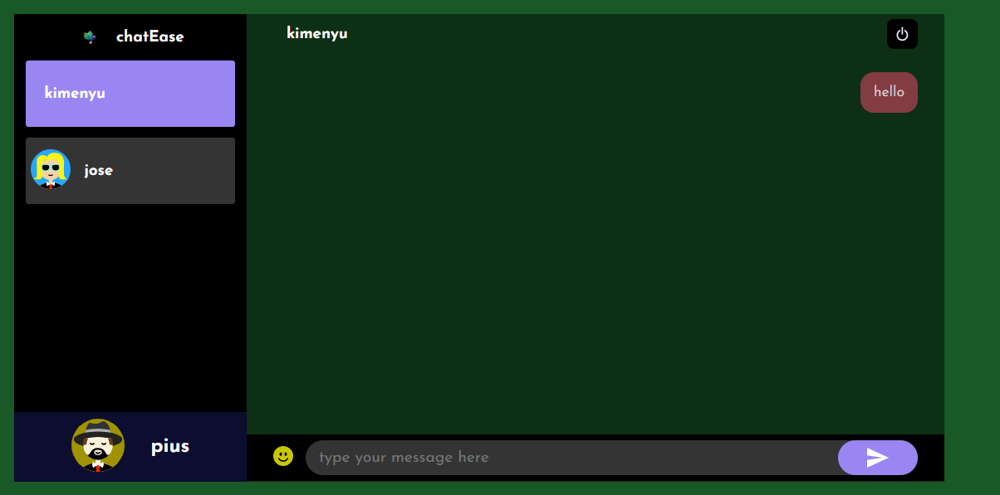

# ChatEase

## Team Members:
- Joseph Njoroge
- Sebastian

## Description:
ChatEase is a real-time messaging application designed for seamless communication and collaboration. The goal was to provide users with an intuitive and efficient chat platform that enhanced their messaging experience.

## Objectives:
The project aimed to achieve the following objectives:
- Gain hands-on experience in developing a full-stack application.
- Implement real-time features using WebSocket technology.
- Understand and apply user authentication and authorization.
- Explore and utilize modern UI/UX design principles.
- Implement data storage and retrieval using databases.

## Technologies Used:
- Frontend: React.js
- Backend: Node.js
- Real-time Communication: WebSocket
- Database: MongoDB
- User Authentication: JWT

## Third-Party Services Used:
- Firebase for authentication

## Challenges Identified:
During the project, the team identified several challenges:
- Implementing real-time messaging efficiently.
- Ensuring secure and robust user authentication.
- Designing an intuitive and responsive user interface.
- Managing and scaling the database for growing user data.
- Handling potential privacy and security concerns.

## Project Approach:
By leveraging Node.js and React, the team aimed to build a scalable and user-friendly chat application that addressed these challenges and provided an exceptional messaging experience.

Thank you for your interest!
